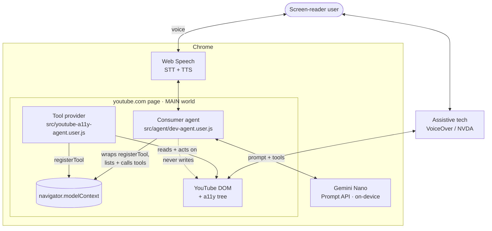
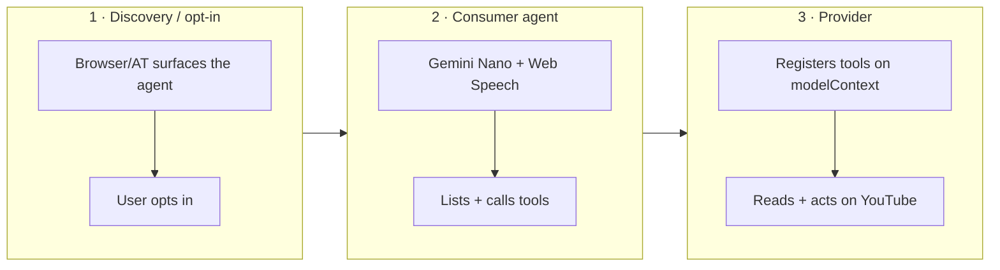
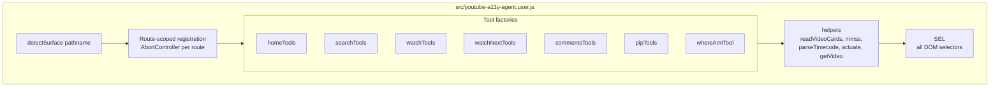
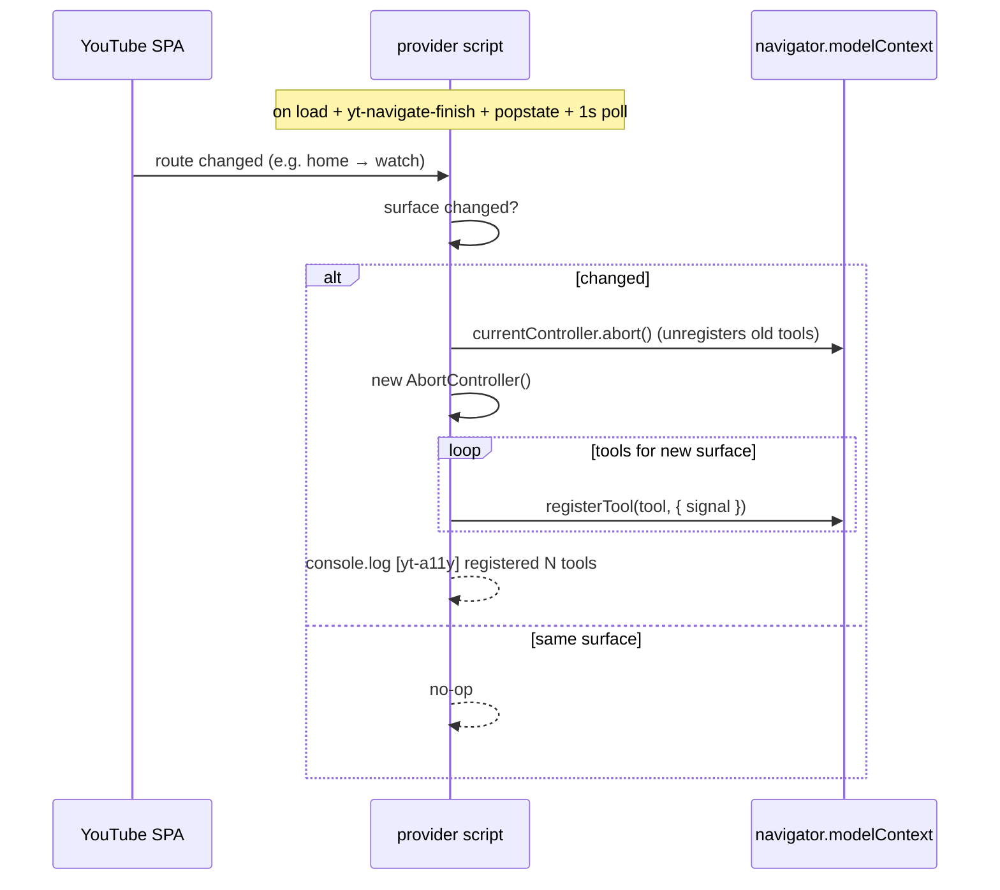
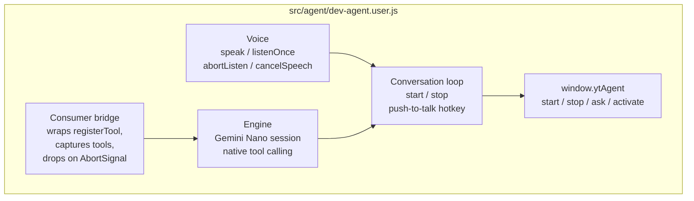
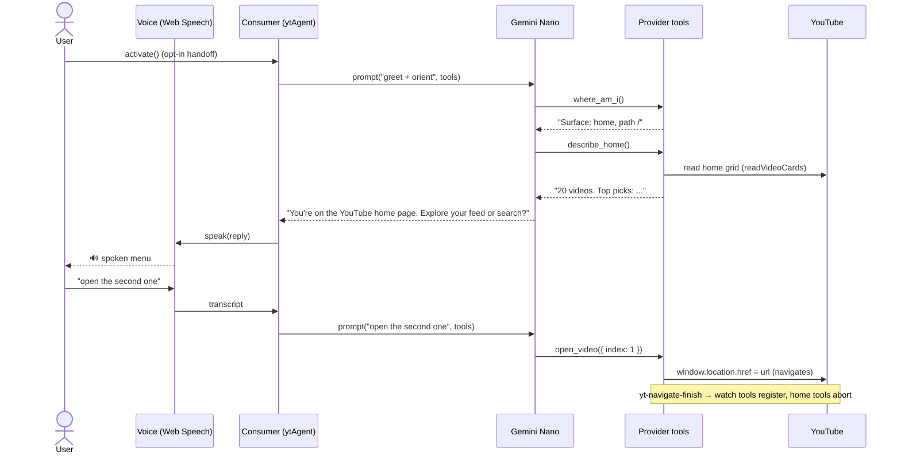
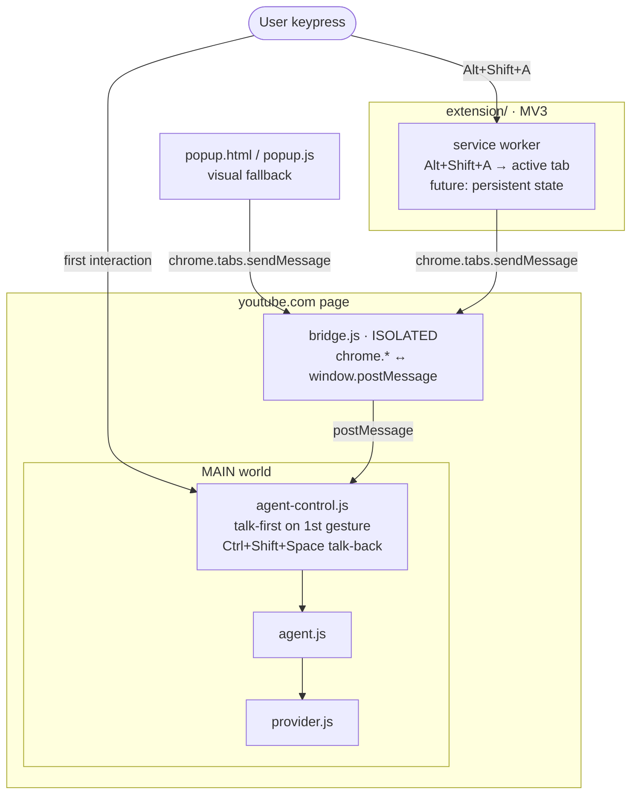

# Architecture — YouTube A11y Agent

> Canonical architecture reference. Grounded in the actual code; keep it in sync when the
> code changes (see "Keeping this doc current" at the bottom). Last updated: 2026-06-04.

## What this is

A WebMCP **tool provider** for YouTube plus an AI **consumer agent**, so a screen-reader
user can use YouTube hands-free by voice. The agent is an **intermediary**: it reads the
page and acts on the user's behalf (navigate, scroll, actuate native controls) but **never
mutates the page or its accessibility tree**. The user's own assistive technology stays
authoritative.

## System context

Key point: the **provider acts on the DOM** (navigation, native-control clicks, scroll);
the **consumer never touches the DOM** — it only talks to the model and to the provider's
tools. The a11y tree is never edited by either.

## The three layers

- **L1 Discovery/opt-in** — browser/platform owned. Dev harness simulates it with
  `ytAgent.activate()`.
- **L2 Consumer agent** — `src/agent/dev-agent.user.js` (dev harness today; MV3 extension
  in production, for persistence across navigations + out-of-page UI). On-device Gemini
  Nano, so no API key, no network, no CSP problem.
- **L3 Provider** — `src/youtube-a11y-agent.user.js`. Runs in the page's MAIN world
  (`@grant none`) so `navigator.modelContext` is visible.

## Provider internals

- **`SEL`** — every selector, centralized. A shared `SEL.card` (title/channel/meta/
  duration) is reused by home, search, and up-next via `readVideoCards()`. When a list
  goes blank, `SEL` is the first place to look (YouTube renames classes often).
- **`detectSurface(pathname)`** — `/`|`/feed*`→home, `/results`→search, `/watch`→watch,
  `/@`·`/channel/`·`/c/`→channel, else other.
- **Route-scoped registration** — see next diagram.

### Route-scoped registration (AbortController)

Aborting the previous controller unregisters exactly the prior route's tools — no manual
bookkeeping. Tools are re-created fresh each route via the `*Tools()` factories.

### Surface → tools

| Surface | Tools |
|---------|-------|
| every route | `where_am_i` |
| home (`/`, `/feed*`) | `list_home_feed`, `describe_home`, `open_video`, `load_more_home` |
| search (`/results`) | `run_search`, `list_results`, `refine_search`, `open_result` |
| watch (`/watch`) | `get_video_info`, `get_transcript`, `summarize_video`, `plain_language_summary`, `jump_to`, `playback_control`, `set_captions` |
| watch-next (`/watch`) | `list_up_next`, `play_next`, `set_autoplay` |
| comments (`/watch`) | `get_comments`, `summarize_comments`, `get_pinned_comment` |
| pip (`/watch`) | `enter_pip`, `exit_pip` |

Tool shape: `{ name, description (model-facing instructions), inputSchema (JSON Schema),
async execute(args) }` → returns `{ content: [{ type:"text", text }] }`. **Read-and-act
only.** Summaries (`summarize_video`, `plain_language_summary`, `summarize_comments`)
return *source material*; the model produces the actual summary.

## Consumer internals

- **Bridge** — the provider's `ModelContext` exposes only `registerTool` (no list/call),
  so the consumer wraps `registerTool` to build a live registry, honoring each tool's
  `AbortSignal` to drop it when its route ends.
- **Engine** — runs `LanguageModel` (Gemini Nano) sessions via a **manual JSON tool loop**
  (`geminiEngine`): Nano's native `create({ tools })` auto-loop is unreliable (narrates
  instead of calling), so the system prompt requests one strict-JSON action per turn, which
  we parse, execute against the captured tool, and feed back. Session rebuilds on toolset
  change.
- **Voice** — Web Speech `speechSynthesis` / `SpeechRecognition`, out-of-band from tools.
  `speak()` waits for `voiceschanged`, sets a voice, avoids the racing `cancel()`, and
  `resume()`s the paused queue (Chrome TTS-silence workarounds).
- **Conversation loop** — `start()` speaks the greeting, then loops listen → respond →
  listen so the user just talks back; ends on a stop word, two silent turns, or `stop()`.
  Turn-taking is **sequential** (listen only after speaking finishes, so the agent never
  captures its own TTS). Optional push-to-talk hotkey runs one turn (the keypress doubles as
  the user gesture some Chrome builds require to open the mic). This is how the user replies
  to the agent's questions hands-free — without touching the console.
- **Listen mode** — `captureUtterance()` dispatches on `state.listenMode`. Default
  **`webspeech`** (Web Speech `SpeechRecognition` — fast, streaming). Opt-in **`nano`**
  (`nanoAsr`: VAD mic capture → on-device Gemini Nano audio transcription) is **experimental**
  — verified accurate but on-device audio inference is slow and briefly janks the page, so
  it's unfit for real-time turn-taking; it auto-falls back to Web Speech on error.
- **Vision** — `describe_image` is a **consumer-local tool** (merged into the model's
  catalog alongside the provider's WebMCP tools). The provider emits a `thumb` URL (text)
  per video; the consumer fetches it and asks Nano (image input) to describe it for a
  non-sighted user. Keeps the tool boundary text-only and uses thumbnails (not video-frame
  canvas grabs) to sidestep cross-origin tainting. Also exposed as `ytAgent.describeImage` /
  `describeThumbnail`. One-shot, so the inference jank is acceptable.

### End-to-end: opt-in greeting + a tool turn

## Cross-cutting decisions

| Decision | Why |
|----------|-----|
| MAIN world (`@grant none`) | `navigator.modelContext` is page-context; invisible from isolated worlds |
| On-device Gemini Nano (Prompt API) | No key, no network, dodges YouTube CSP; user's chosen engine |
| Read-and-act, no DOM injection | AT-safe; the user's screen reader stays authoritative |
| Tools text-only; media out-of-band | WebMCP has no standardized multimodal tool I/O yet |
| Centralized `SEL` + shared `readVideoCards` | YouTube selector churn — one place to fix drift |
| Route-scoped registration | Agent only ever sees tools relevant to the current surface |

## Verified vs. pending

- **Verified live (2026-06-04):**
  - `navigator.modelContext` namespace; main-world registration passes youtube.com's
    `tools` permissions policy (interactive, by the user).
  - **Home** journey end to end (interactive).
  - **Agent end to end (interactive):** on-device Gemini Nano with the **manual JSON tool
    loop** spoke the `activate()` greeting and executed a real tool call that navigated the
    page (observed video transition). Confirms TTS (voices/cancel/resume fix) and that the
    manual loop fires tools where Nano's native tool-calling did not.
  - **Search / Watch / Watch-Next / Comments selectors** — via the headless harness
    `scripts/verify-selectors.mjs` (`npm run verify:selectors`), which runs the provider's
    real `readVideoCards`/`SEL.card` + watch/`<video>` + comments logic against live
    YouTube. All fields populate. The harness caught a watch-next channel-extraction bug
    (channel isn't a `/@` link in the sidebar lockup) — fixed with a first-metadata-line
    fallback in `readVideoCards`.
- **Partial / needs a flagged interactive run:**
  - **PiP (open question c)** — button + fallback are present; which path actually fires
    (direct API vs. native-button gesture) needs a real tool call under the flags.
  - **Transcript open** — reading an open transcript works; opening a closed one is
    best-effort.
- **Known caveat:** during a preroll **ad**, `<video>.duration`/`currentTime` are the ad's;
  `get_video_info` detects the player's `ad-showing` class and reports `adPlaying` instead
  of ad timing.
- **Multimodal Prompt API (2026-06):** this Chrome build exposes on-device **audio + image**
  input (`expectedInputs`); Nano transcribed a `webm/opus` mic clip accurately. Audio
  inference is slow / janks the page → Web Speech stays the default listen mode, Nano ASR is
  opt-in. Image input powers **vision** (`describe_image`) — verified end-to-end: `thumb`
  derivation + fetch via the headless harness, and the Nano describe step interactively
  (returns rich, accurate descriptions). Note: the on-device model can't be driven by
  automation (Chrome gates it to a real user profile), so vision is confirmed interactively.
- **Open question (d):** multimodal contract when the consumer becomes the extension.

## Production trajectory

Userscripts → **MV3 extension** — **scaffolded** in `extension/`:

- Provider + agent run as **`world:"MAIN"` content scripts**, auto-injected on every YouTube
  page (so the agent survives navigation — no manual re-paste). They are the *same* `src/`
  files, synced by `npm run build:extension` (single source of truth).
- `navigator.modelContext` + the Prompt API live in MAIN; `chrome.*` only works in ISOLATED
  — so **`bridge.js`** (ISOLATED) relays popup commands to the MAIN-world agent via
  `window.postMessage`, and `agent-control.js` maps them onto `window.ytAgent`.
- **Talk-first entry (accessibility).** A popup click is sighted-first, so `agent-control.js`
  instead **speaks on the user's first interaction** with the page (a valid audio gesture; a
  screen-reader user generates one immediately) and enables `Ctrl+Shift+Space` talk-back
  (each press is the fresh gesture the mic needs). `Alt+Shift+A` (a `commands` shortcut via
  the service worker) triggers the full spoken overview. This is the closest legal
  approximation of layer-1 "discovery/opt-in" — browsers forbid audio on bare page-load.
- `popup.html` is a **visual fallback** UI — in the extension's own surface, out of the
  page's a11y tree (AT-safe).
- **Not yet:** the service worker holds the hotkey dispatch but not **conversation state**;
  persisting history across full navigations is the next step. Also: icons, Web Store packaging.

## Keeping this doc current

Update this file in the **same change** that touches:
- `src/youtube-a11y-agent.user.js` — tools, `SEL`, surface detection, registration
- `src/agent/dev-agent.user.js` — bridge, engine, voice, public API
- the engine choice, the three-layer model, or the production trajectory

When changing `SEL` or `readVideoCards`, re-run `npm run verify:selectors` and update the
"Verified vs. pending" section with what the harness found.

When changing `src/youtube-a11y-agent.user.js` or `src/agent/dev-agent.user.js`, re-run
`npm run build:extension` to resync `extension/provider.js` + `extension/agent.js` (they're
generated — never edit them directly).

The diagrams reference real symbols (`readVideoCards`, `detectSurface`, `ytAgent`,
`navigator.modelContext`); if you rename them, update the diagrams too.
