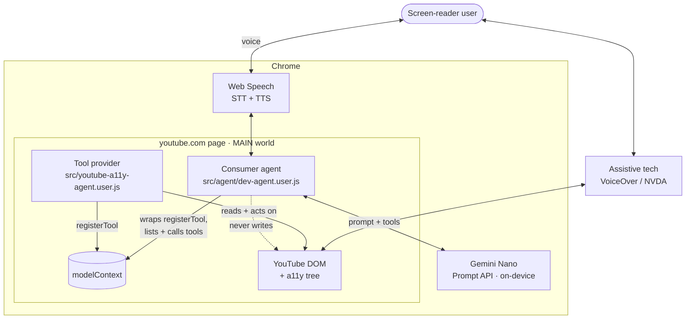
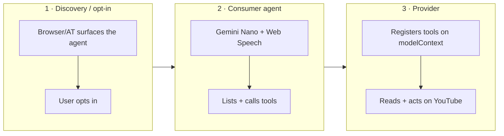
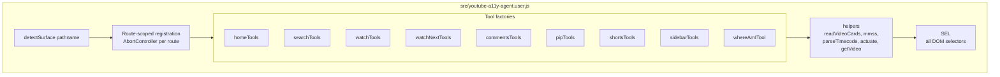
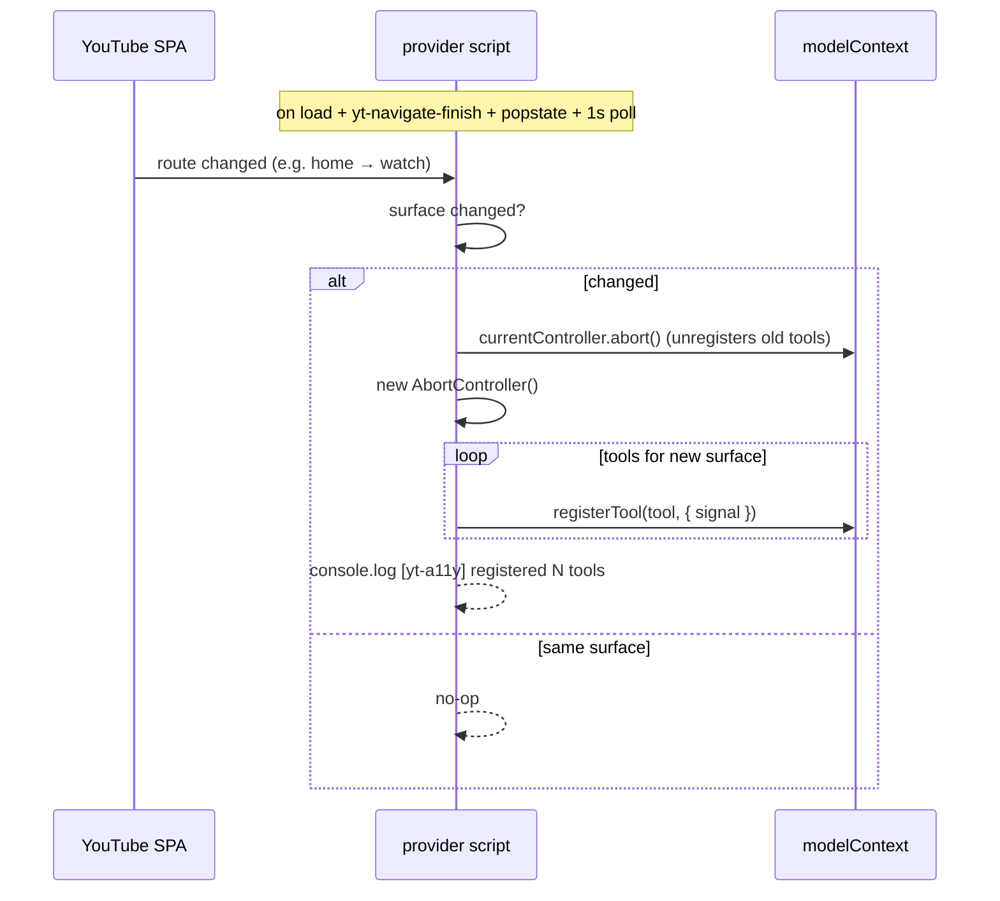
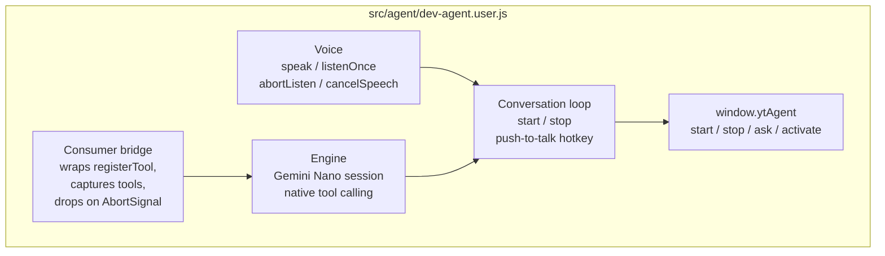
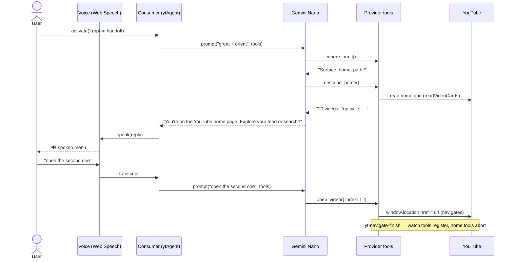
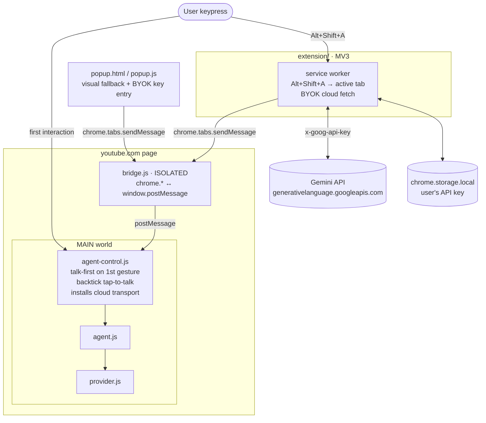

# Architecture — YouTube A11y Agent

> Canonical architecture reference. Grounded in the actual code; keep it in sync when the
> code changes (see "Keeping this doc current" at the bottom). Last updated: 2026-06-07.

## What this is

A WebMCP **tool provider** for YouTube plus an AI **consumer agent**, so a screen-reader
user can use YouTube hands-free by voice. The agent is an **intermediary**: it reads the
page and acts on the user's behalf (navigate, scroll, actuate native controls) but **never
mutates the page or its accessibility tree**. The user's own assistive technology stays
authoritative.

## System context

Key point: the **provider acts on the DOM** (navigation, native-control clicks, scroll);
the **consumer never touches the DOM** — it only talks to the model and to the provider's
tools. The a11y tree is never edited by either.

## The three layers

- **L1 Discovery/opt-in** — browser/platform owned. Dev harness simulates it with
  `ytAgent.activate()`.
- **L2 Consumer agent** — `src/agent/dev-agent.user.js` (dev harness today; MV3 extension
  in production, for persistence across navigations + out-of-page UI). On-device Gemini
  Nano, so no API key, no network, no CSP problem.
- **L3 Provider** — `src/youtube-a11y-agent.user.js`. Runs in the page's MAIN world
  (`@grant none`) so `modelContext` is visible (`document.modelContext`, or
  `navigator.modelContext` on Chrome 149).

## Provider internals

- **`SEL`** — every selector, centralized. A shared `SEL.card` (title/channel/meta/
  duration) is reused by home, search, and up-next via `readVideoCards()`. When a list
  goes blank, `SEL` is the first place to look (YouTube renames classes often).
- **`detectSurface(pathname)`** — `/`|`/feed*`→home, `/results`→search, `/watch`|`/shorts`→watch,
  `/@`·`/channel/`·`/c/`→channel, else other. (Shorts maps to watch: it has a `<video>`, so
  `playback_control` works via the generic `video` selector; sidebar/transcript tools no-op.
  Shorts also gets `next_short`/`prev_short`, which actuate YouTube's native up/down feed-nav
  arrows and no-op off `/shorts`.)
- **Route-scoped registration** — see next diagram.

### Route-scoped registration (AbortController)

Aborting the previous controller unregisters exactly the prior route's tools — no manual
bookkeeping. Tools are re-created fresh each route via the `*Tools()` factories.

### Surface → tools

| Surface | Tools |
|---------|-------|
| every route | `where_am_i`, `get_account`, `list_sidebar`, `open_sidebar_item` |
| home (`/`, `/feed*`) | `list_home_feed`, `describe_home`, `open_video`, `load_more_home`, `list_categories`, `select_category` |
| search (`/results`) | `run_search`, `list_results`, `refine_search`, `open_result` |
| watch (`/watch` or `/shorts`) | `get_video_info`, `get_transcript`, `summarize_video`, `plain_language_summary`, `jump_to`, `playback_control`, `set_captions` |
| watch-next (`/watch`) | `list_up_next`, `play_next`, `set_autoplay` |
| shorts (`/shorts`) | `next_short`, `prev_short` (registered on every watch route; no-op off `/shorts`) |
| comments (`/watch`) | `get_comments`, `summarize_comments`, `get_pinned_comment` |
| pip (`/watch`) | `enter_pip`, `exit_pip` |

Tool shape: `{ name, description (model-facing instructions), inputSchema (JSON Schema),
async execute(args) }` → returns `{ content: [{ type:"text", text }] }`. **Read-and-act
only.** Summaries (`summarize_video`, `plain_language_summary`, `summarize_comments`)
return *source material*; the model produces the actual summary.

## Consumer internals

- **Bridge** — the provider's `ModelContext` exposes only `registerTool` (no list/call),
  so the consumer wraps `registerTool` to build a live registry, honoring each tool's
  `AbortSignal` to drop it when its route ends.
- **Engines (two, one protocol)** — both drive tools via the same **manual JSON tool loop**
  (`JSON_PROTOCOL`: one strict-JSON action per turn, which we parse, execute against the
  captured tool, and feed back):
  - **`geminiEngine`** — on-device Gemini Nano (`LanguageModel`), one persistent session
    per tab, every `session.prompt()` under the 12 s `MODEL_TURN_BUDGET_MS` abort.
    (Nano's native `create({ tools })` auto-loop narrates instead of calling — and Prompt
    API function calling is still only "Proposed" in Chromium, so the manual loop stays.)
  - **`cloudEngine`** — opt-in **BYOK** Gemini API fallback (`gemini-3.1-flash-lite`,
    pinned stable). Stateless: replays the persisted conversation as real `contents` turns;
    uses JSON response mode (`responseMimeType`) so the protocol is near-deterministic;
    every fetch is time-boxed (`CLOUD_TIMEOUT_MS`, and a fetch abort *reliably* ends a
    request — unlike Nano's abort). Off-device ⇒ **cannot freeze the machine**.
  - **Dispatch** (`ask()`): deterministic command layer first → kill switch
    (`state.modelEnabled`, default OFF) → `modelChoice()`: explicit `setEngine()` override,
    else "auto" prefers cloud when configured (`setCloudKey` dev key or the extension's
    service-worker transport), else Nano. A custom `useEngine(fn)` mock always wins.
- **Conversation memory (`convo`)** — the last `CONVO_MAX` turns persist in the tab's
  `sessionStorage`, surviving the full-page loads that `open_video`/`run_search` trigger.
  Nano gets a compact "Recent conversation" block per turn; the cloud engine gets the
  history as real turns; `state.lastReply` ("repeat") is restored from it on load.
- **Voice** — Web Speech `speechSynthesis` / `SpeechRecognition`, out-of-band from tools.
  `speak()` waits for `voiceschanged`, picks a **local** voice (`pickVoice()` prefers
  `localService` voices; online "Google" voices fetch per-utterance audio that can stall ~25 s
  and freeze the turn), avoids the racing `cancel()`, `resume()`s the paused queue (Chrome
  TTS-silence workarounds), and runs a length-scaled **watchdog** that resolves the promise if
  an utterance never ends so a turn never hangs. It's a single interrupt-driven channel —
  `speak()` cancels the previous line instead of queueing.
- **Conversation loop** — `start()` speaks the greeting, then loops listen → respond →
  listen so the user just talks back; ends on a stop word, two silent turns, or `stop()`.
  Turn-taking is **sequential** (listen only after speaking finishes, so the agent never
  captures its own TTS). Optional push-to-talk hotkey runs one turn (the keypress doubles as
  the user gesture some Chrome builds require to open the mic). This is how the user replies
  to the agent's questions hands-free — without touching the console.
- **Tap-to-talk + barge-in** (`enableTalk`, primary input) — tap the talk key (default `` ` ``)
  once and speak; **non-continuous** recognition auto-ends on a pause, so the mic is never held
  open. Every press is universal barge-in (cancels speech, aborts any in-flight listen, bumps
  `talk.gen` so a stale LLM reply can't speak over the new turn). **Earcons** (`audio`, Web
  Audio tones) signal listening/captured/ready/error so the user is never left in silence; the
  engine speaks **progress cues** (`TOOL_CUE`: "Searching.", "Opening.") for slow tools.
  `listenOnce` resolves on **`onend`** — i.e. only after Chrome has actually released the mic —
  so TTS never starts while the mic is still open. It force-`abort()`s on a 10 s watchdog. There
  is **no continuous recognizer** — the removed `holdStart/holdStop` path was the root of the
  machine-hang / blocked-mic incidents. `releaseAll()` drops the mic + cancels speech +
  `audio.suspend()`s the earcon context on `visibilitychange`/`blur`/`pagehide`/`beforeunload`.
- **The freeze gate — `beginListen()`** (macOS `coreaudiod` whole-machine-freeze fix; full
  diagnosis in [`docs/research/voice-audio-anti-freeze.md`](../research/voice-audio-anti-freeze.md)).
  Opening a mic capture **while audio is rendering on the output device** forces macOS CoreAudio
  to reconfigure the output-device session, deadlocking the single system-wide `coreaudiod`
  daemon → whole-machine beachball. `getUserMedia`/WebRTC (Meet/FaceTime) coexist with playing
  audio; bare `webkitSpeechRecognition` (processed / Voice-Processing-I/O capture) does not. So
  **every capture path goes through `captureUtterance` → `await beginListen()` first**: cancel
  TTS → **await each page `<video>`/`<audio>`'s real `pause` event** (`duckMedia` is awaitable;
  `m.pause()` returns before the output stream tears down) → **`audio.suspend()`** the earcon
  `AudioContext` → wait for `speechSynthesis` silence → `OUTPUT_SETTLE_MS` settle → log
  `beginListen: gate open — synth.speaking=… unpausedMedia=…` (regression canary). `restoreMedia`
  resumes after every window.
- **Capture-path cures** — three options layered on the gate: **`webspeech`** (default; cloud Web
  Speech, gate-guarded), **`nano`** (`setListenMode("nano")` — plain `getUserMedia` → on-device
  Gemini Nano audio ASR; the **guaranteed freeze-proof** path: no `webkitSpeechRecognition`/VPIO,
  but slower + needs the multimodal flag), and an opt-in **constrained track** (`setConstrainedSTT`)
  feeding Web Speech an **echo-cancellation-OFF `getUserMedia` track** via `rec.start(track)` to
  skip VPIO (off by default — `start(track)` is flag-gated/undetectable). All `getUserMedia` paths
  set `echoCancellation/noiseSuppression/autoGainControl:false`.
- **Cross-navigation continuity** — navigating provider tools call `pend()` (sessionStorage);
  the consumer `consumePending()`s it on the next page and speaks it. This is what makes
  "search for X" / "open Y" continue speaking after the full-page load that resets the agent.
- **Gesture relay** (`armGestureRelay`) — for activation-gated APIs. Measured live
  (2026-06-07, `scripts/verify-gestures.mjs`): `requestPictureInPicture` needs *transient*
  user activation (~5 s window), which voice latency outlives, and the native PiP button is
  equally gated — and a bare Shift press grants **no** activation. So the deterministic
  "picture in picture" command arms a one-shot keydown: the user's next keypress runs
  `enter_pip` *inside* the trusted handler, where activation is fresh. Escape cancels; the
  talk key passes through to a new voice turn.
- **Arrow-key browse mode** — `startBrowse`/`stopBrowse` (armed by the extension on home +
  search): captures arrows (only while armed, not in text fields) so the user steps through
  the current surface's videos hearing each described — Down/Up move, Enter plays (`openIndex`),
  Escape exits. The keydown listener stays attached after Escape (inert while disarmed), so once
  `everArmed` an arrow press on a list surface re-arms — Escape is never a keyboard dead end.
  `feed()` pulls the items from the surface's list tool. Off on `/watch` (arrows seek the
  player). A guided-navigation layer; tools/voice unchanged.
- **Listen mode** — `captureUtterance()` dispatches on `state.listenMode`. Default
  **`webspeech`** (Web Speech `SpeechRecognition` — fast, streaming). Opt-in **`nano`**
  (`nanoAsr`: VAD mic capture → on-device Gemini Nano audio transcription) is **experimental**
  — verified accurate but on-device audio inference is slow and briefly janks the page, so
  it's unfit for real-time turn-taking; it auto-falls back to Web Speech on error.
- **Vision** — `describe_image` is a **consumer-local tool** (merged into the model's
  catalog alongside the provider's WebMCP tools). The provider emits a `thumb` URL (text)
  per video; the consumer fetches it and asks Nano (image input) to describe it for a
  non-sighted user. Keeps the tool boundary text-only and uses thumbnails (not video-frame
  canvas grabs) to sidestep cross-origin tainting. Also exposed as `ytAgent.describeImage` /
  `describeThumbnail`. One-shot, so the inference jank is acceptable.

### End-to-end: opt-in greeting + a tool turn

## Cross-cutting decisions

| Decision | Why |
|----------|-----|
| MAIN world (`@grant none`) | `document.modelContext` (Chrome 149: `navigator.modelContext`) is page-context; invisible from isolated worlds |
| Deterministic-first; models behind one kill switch | Common verbs must never wait on (or be misrouted by) a model; `state.modelEnabled` default OFF gates Nano **and** cloud |
| On-device Gemini Nano (Prompt API) | No key, no network; but unbounded inference froze the dev machine → 12 s abort + kill switch |
| **BYOK cloud fallback (Gemini API)** | Off-device = no freeze risk; public repo = key is the *user's*, never in code: dev key in localStorage, extension key in `chrome.storage.local` read only by the service worker |
| Read-and-act, no DOM injection | AT-safe; the user's screen reader stays authoritative |
| Tools text-only; media out-of-band | Settled (see "Media contract" below): WebMCP defines no tool-result content model, and consumer model output is text-only anyway |
| Centralized `SEL` + shared `readVideoCards` | YouTube selector churn — one place to fix drift |
| Route-scoped registration | Agent only ever sees tools relevant to the current surface |

## Media contract (settled 2026-06-07 — was open question d)

Who owns speech/listening/vision in this stack, and why this doesn't change when the
consumer is the extension:

| Modality | Owner | Rationale |
|----------|-------|-----------|
| TTS (speaking) | **Consumer agent** (`voice.speak`, single interrupt-driven channel) | No standard assigns TTS to browser/AT; model output is text; the agent is the only layer that knows turn state (barge-in, earcons, progress cues) |
| STT (listening) | **Consumer agent** (`captureUtterance` behind the `beginListen` freeze gate) | Mic lifecycle is safety-critical (coreaudiod); must stay with the layer that owns the gate |
| Vision | **Consumer-local tool** (`describe_image`) | Provider passes a `thumb` URL (text); the consumer does the model call (Nano image input, or the cloud engine's `inlineData`) |
| Tool I/O | **Text only** | WebMCP (draft 2026-06-05) defines **no content-type model** for tool results — multimodal lives in open issues (#41 image I/O, #86 content types, #81 file attachments) with zero merged PRs. The underlying MCP spec (2025-11-25) has `text`/`image`/`audio`/`resource_link` blocks — our `{content:[{type:"text"}]}` envelope and thumb-URL pattern map cleanly onto it (URL ⇒ `resource_link`) when WebMCP adopts a content model. |
| Consumer model output | **Text only** | Chrome Prompt API (shipped 148) accepts image+audio *input* but emits only text — so speech synthesis can't move into the model layer even in principle today |

Revisit triggers: WebMCP merges a content model (watch webmcp#86/#41), or the Prompt API
gains output modalities. Until then: **no refactor needed**, and the pattern is
forward-compatible.

## Verified vs. pending

- **Verified live (2026-06-04):**
  - `navigator.modelContext` namespace; main-world registration passes youtube.com's
    `tools` permissions policy (interactive, by the user).
  - **Home** journey end to end (interactive).
  - **Agent end to end (interactive):** on-device Gemini Nano with the **manual JSON tool
    loop** spoke the `activate()` greeting and executed a real tool call that navigated the
    page (observed video transition). Confirms TTS (voices/cancel/resume fix) and that the
    manual loop fires tools where Nano's native tool-calling did not.
  - **Search / Watch / Watch-Next / Comments selectors** — via the headless harness
    `scripts/verify-selectors.mjs` (`npm run verify:selectors`), which runs the provider's
    real `readVideoCards`/`SEL.card` + watch/`<video>` + comments logic against live
    YouTube. All fields populate. The harness caught a watch-next channel-extraction bug
    (channel isn't a `/@` link in the sidebar lockup) — fixed with a first-metadata-line
    fallback in `readVideoCards`.
  - **Home categories** (`list_categories`) — confirmed live (12 chips via
    `ytd-feed-filter-chip-bar-renderer yt-chip-cloud-chip-renderer`). **Account name** is NOT
    in the DOM (only after opening the account menu, which we don't); `get_account` returns
    reliable `signedIn` and `name: null`, so greet warmly without a name.
- **Verified live (2026-06-07, `scripts/verify-gestures.mjs` — trusted CDP input, clean
  no-gesture controls):**
  - **PiP (open question c) — RESOLVED.** `requestPictureInPicture` with no gesture →
    `NotAllowedError`; immediately after a trusted keypress → succeeds; 6 s after →
    activation expired, fails; untrusted `el.click()` on the native PiP button without
    activation → no PiP (equally gated). A bare Shift keydown grants **no** activation.
    ⇒ the consumer's **gesture relay** is the working path.
  - **Transcript open** — `SEL.watch.transcriptOpenButton` matches the real "Show
    transcript" button, and an untrusted click opens the engagement panel. The logged-out
    automation profile gets YouTube's **new tabbed shell** ("In this video": Chapters /
    Transcript chips, `chip-view-model`) which never hydrated segments — not even with
    trusted clicks or shadow-DOM-piercing search — so `get_transcript` now also clicks the
    Transcript chip (`SEL.watch.transcriptTabChip`) and the hydration step stays
    best-effort, pending one interactive run on a real signed-in profile (where reading
    open segments was verified 2026-06-04).
- **Known caveat:** during a preroll **ad**, `<video>.duration`/`currentTime` are the ad's;
  `get_video_info` detects the player's `ad-showing` class and reports `adPlaying` instead
  of ad timing.
- **Multimodal Prompt API (2026-06):** this Chrome build exposes on-device **audio + image**
  input (`expectedInputs`); Nano transcribed a `webm/opus` mic clip accurately. Audio
  inference is slow / janks the page → Web Speech stays the default listen mode, Nano ASR is
  opt-in. Image input powers **vision** (`describe_image`) — verified end-to-end: `thumb`
  derivation + fetch via the headless harness, and the Nano describe step interactively
  (returns rich, accurate descriptions). Note: the on-device model can't be driven by
  automation (Chrome gates it to a real user profile), so vision is confirmed interactively.
- **Open question (d): RESOLVED** — see "Media contract" above.

## Production trajectory

Userscripts → **MV3 extension** — **scaffolded** in `extension/`:

- Provider + agent run as **`world:"MAIN"` content scripts**, auto-injected on every YouTube
  page (so the agent survives navigation — no manual re-paste). They are the *same* `src/`
  files, synced by `npm run build:extension` (single source of truth).
- `document.modelContext` + the Prompt API live in MAIN; `chrome.*` only works in ISOLATED
  — so **`bridge.js`** (ISOLATED) relays popup commands to the MAIN-world agent via
  `window.postMessage`, and `agent-control.js` maps them onto `window.ytAgent`.
- **BYOK cloud path:** the popup saves the user's Gemini key straight to
  `chrome.storage.local` (never via the page); only the **service worker** reads it and
  makes the `generateContent` fetch (page CSP irrelevant, key invisible to page JS).
  `agent-control.js` installs `ytAgent.setCloudTransport()` so the MAIN-world agent's
  cloud turns route page → bridge → SW and back by correlation id — request text crosses
  the bridge, the key never does.
- **Talk-first entry (accessibility).** A popup click is sighted-first, so `agent-control.js`
  instead **speaks on the user's first interaction** with the page (a valid audio gesture; a
  screen-reader user generates one immediately) and enables **backtick `` ` `` tap-to-talk**
  via `enableTalk()` (each press is the fresh gesture the mic needs). `Ctrl+Shift+Space`
  push-to-talk remains a dev-only opt-in (`ytAgent.enablePushToTalk()`), not wired in the
  extension. `Alt+Shift+A` (a `commands` shortcut via the service worker) triggers the full
  spoken overview. This is the closest legal approximation of layer-1 "discovery/opt-in" —
  browsers forbid audio on bare page-load.
- `popup.html` is a **visual fallback** UI — in the extension's own surface, out of the
  page's a11y tree (AT-safe).
- **Conversation state** persists across full navigations via the agent's `convo` store
  (tab `sessionStorage`) — chosen over service-worker state because it works identically
  in the userscript form and needs no extra messaging; the SW carries only what *must* be
  extension-side (the key + fetch). Icons (`npm run build:icons`) and Web Store docs
  (`docs/store/`) are in place; remaining for the store: host the privacy policy at a
  public URL, screenshots, packed upload.

## Keeping this doc current

Update this file in the **same change** that touches:
- `src/youtube-a11y-agent.user.js` — tools, `SEL`, surface detection, registration
- `src/agent/dev-agent.user.js` — bridge, engine, voice, public API
- the engine choice, the three-layer model, or the production trajectory

When changing `SEL` or `readVideoCards`, re-run `npm run verify:selectors` and update the
"Verified vs. pending" section with what the harness found.

When changing `src/youtube-a11y-agent.user.js` or `src/agent/dev-agent.user.js`, re-run
`npm run build:extension` to resync `extension/provider.js` + `extension/agent.js` (they're
generated — never edit them directly).

The diagrams reference real symbols (`readVideoCards`, `detectSurface`, `ytAgent`,
`modelContext`); if you rename them, update the diagrams too.
